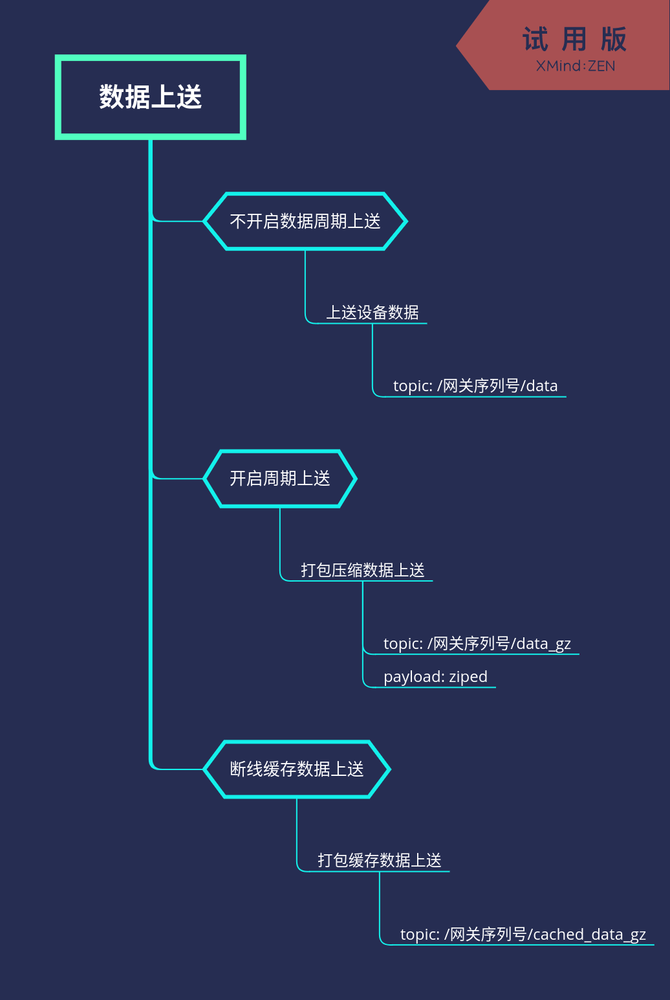

# 设备数据上送、下置、指令说明

## Topic列表

| TOPIC | 说明 | QOS |
| :--- | :--- | :--- |
| /<gateway_sn>/devices | 设备列表上送（未压缩) | 0/1 |
| /<gateway_sn>/devices_gz | 设备列表上送（ZIP压缩) | 0/1 |
| /<gateway_sn>/data | 单个设备数据上送（未压缩) | 0/1 |
| /<gateway_sn>/data_gz | 多个设备数据上送(ZIP压缩) | 0/1 |
| /<gateway_sn>/event | 设备事件（未压缩) | 0/1 |
| /<gateway_sn>/cached_data | 断线缓存数据上送（未压缩) | 0/1 |
| /<gateway_sn>/cached_data_gz | 断线缓存数据上送（ZIP压缩) | 0/1 |
| /<gateway_sn>/output | 设备数据下置(网关订阅主题) | 0/1 |
| /<gateway_sn>/result/output | 设备数据下置结果反馈 | 0/1 |
| /<gateway_sn>/command | 设备指令执行(网关订阅主题) | 0/1 |
| /<gateway_sn>/result/command | 设备指令执行结果反馈 | 0/1 |

备注:

1. 所有Topic的Payload使用JSON格式数据
2. 压缩是标准的ZIP压缩算法（如使用zlib库进行压缩)
3. gateway_sn 是网关产品序列号
4. 网关连接平台成功后，需要订阅数据下置主题，以接收来自平台的数据下置消息

### 设备（模型)列表格式

示例：

``` json
{
    "2-30002-001843-00059":{
        "meta": {
            "inst": "ThingsLink",
            "description": "ThingsLink IOE Device",
            "app": "FreeIOE",
            "link": "http://device.freeioe.org/device?name=",
            "app_inst": "ioe",
            "platform": "openwrt/arm_cortex-a9_neon",
            "skynet": 1892,
            "name": "ThingsLink",
            "series": "FreeIOE",
            "manufacturer": "BambooShoots IOE",
            "version": 1175,
            "firmware": "1.95"
        },
        "inputs": [{
            "name": "cpuload",
            "desc": "CPU load avg_15"
        }, {
            "unit": "\u2103",
            "name": "cpu_temp",
            "desc": "CPU temperature"
        }, {
            "vt": "int",
            "desc": "Running status of freeioe_Vserial",
            "name": "app_run_freeioe_Vserial"
        }],
        "commands": [{
            "name": "cfg_crash_ack",
            "desc": "Configuration file crash acknowledgement"
        }]
    },
    "2-30002-001843-00059.Net_info": {
        "outputs": {},
        "meta": {
            "manufacturer": "BambooShoots IOE",
            "inst": "net_info",
            "description": "net_info Meta",
            "app": "APP00000115",
            "app_inst": "Net_info",
            "series": "Unknown",
            "name": "net_info",
            "link": "http://device.freeioe.org/device?name="
        },
        "inputs": [{
            "vt": "string",
            "desc": "default_gw",
            "name": "default_gw"
        }, {
            "vt": "string",
            "desc": "gw_interface",
            "name": "gw_interface"
        }, {
            "name": "del_interface",
            "desc": "del_interface"
        }, {
            "name": "mod_interface",
            "desc": "mod_interface"
        }]
    }
}
```

其中"2-30002-001843-00059"和"2-30002-001843-00059.Net_info"为JSON字典中的key，也是设备序列号，须保证平台唯一。 只能包含：数字、字母、-和.

设备模型信息说明

| 数据项 | 说明 | 备注 |
| :--- | :--- | :---- |
| meta | 设备信息 | 除去下述字段，用户可自定义其他字段信息 |
| meta.manufacturer | 设备厂家信息 | |
| meta.inst | 设备在网关中的实例名称（如: 电表#1) | |
| meta.description | 设备描述 | |
| meta.app | 隶属应用ID | |
| meta.app_inst | 隶属应用的实例名 | |
| meta.series | 设备型号 | |
| meta.name | 设备名称 | |
| meta.link | 更多设备信息描述Link | |
| inputs | 设备数据项 | 数组(可扩展)，用以数据上送（采集） |
| inputs[i].vt | 数据类型 | float/int/string 默认为float |
| inputs[i].name | 名称 | 设备内唯一 |
| inputs[i].desc | 描述 |  |
| inputs[i].unit | 单位 |  |
| outputs | 设备输出项 | 数组(可扩展)，用以数据下置 |
| outputs[i].name | 名称 | 设备内唯一 |
| outputs[i].desc | 描述 |  |
| commands | 设备指令项 | 数组(可扩展) |
| commands[i].name | 名称 | 设备内唯一 |
| commands[i].desc | 描述 |  |

### 单个数据上送

数据格式:

``` json
[
	["<device_sn>/<input_name>/<input_property>", "<value>", "<timestamp>", "<quality>"]
]
```

数据示例:

``` json
[
	["TRTX011933000001/cpu_load/value", 0.12, 1562474541.01, 0]
]
```

| 数据项 | 说明 | 备注 |
| :--- | :--- | :---- |
| device_sn | 设备备序列号, 跟网关序列号一样，要保证本平台内唯一|
| input_name | 设备采集点名称 |
| input_property | 采集属性(通常为value)组成 |
| timestamp | 数据时间戳（浮点） | 小数部分是毫秒值，.01 是10毫秒 |
| value | 数据（整数、浮点、字符串) | |
| quality | 质量戳 | 表明数据质量，0代表数据可信，其他表示数据可信值较低 |

### 多个数据上送

格式为数组，数据示例
``` json
[
	["<device_sn>/<input_name>/<input_property>", "<value>", "<timestamp>", "<quality>"],
	["<device_sn>/<input_name>/<input_property>", "<value>", "<timestamp>", "<quality>"]
]
```
具体字段含义同单个数据上传的字段。


### 设备事件

数据示例:

``` json
[
    "<device_sn>",
    {
        "level": 3,
        "type": "DEV",
        "info": "设备XXXX故障",
        "data": {
            "xxx": "xxxxxx"
        }
    },
    1562474541.01
]
```

| 数据项 | 说明 | 备注 |
| :--- | :--- | :---- |
| 0 | 设备序列号 | |
| 1 | 信息节点 | |
| .level | 事件等级 | |
| .type | 事件类型(SYS/DEV/COMM/DATA/APP) | 字符串 |
| .info | 事件说明 | 字符串 |
| .data | 事件自定义数据 | 对象 |
| 2 | 时间戳 | 事件发生时间 |

### 数据下置格式

示例:

``` json
{
    "id": "XXXXXX",
    "data":{
        "device": "<device_sn>",
        "output": "<output_name>",
        "prop":"value",
        "value":10
    }
}
```

| 数据项 | 说明 | 备注 |
| :--- | :--- | :---- |
| id | 数据下置指令唯一ID，用作反馈执行结果 | 建议使用UUID字符串 |
| data | 数据 | |
| data.device | 设备序列号 | |
| data.output | 设备输入项ID | |
| data.prop | 输出项属性名(通常为value) | |
| data.value | 输出内容(数字、字符串、JSON对象) | |

### 数据下置结果反馈

示例:

``` json
{
    "id":"XXXXXX",
    "result":true,
    "message":"Output to xxxx successfully",
    "timestamp":1562474541.01,
    "timestamp_str":"Sun Jul  7 13:04:13 2019"
}
```

| 数据项 | 说明 | 备注 |
| :--- | :--- | :---- |
| id | 数据下置指令唯一ID | 来自数据下置时平台下发的id属性 |
| result | 结果(boolean) | |
| message | 执行结果信息（字符串) | |
| timestamp | 执行反馈时间戳 | |
| timestamp_str | 执行反馈时间戳字符串（不包含毫秒值) | |

### 设备指令执行

示例:

``` json
{
    "id": "XXXXXXXX",
    "data": {
        "device": "<device_sn>",
        "cmd": "stop_run",
        "param": "force"
    }
}
```

| 数据项 | 说明 | 备注 |
| :--- | :--- | :---- |
| id | 指令执行请求的唯一ID，用作反馈执行结果 | 建议使用UUID字符串 |
| data | 数据 | |
| data.device | 设备序列号 | |
| data.cmd | 设备指令名称 | |
| data.param | 指令参数(数字、字符串、JSON对象) | |

### 指令执行结果反馈

示例:

``` json
{
    "id":"XXXXXX",
    "result":true,
    "message":"Output to xxxx successfully",
    "timestamp":1562474541.01,
    "timestamp_str":"Sun Jul  7 13:04:13 2019"
}
```

| 数据项 | 说明 | 备注 |
| :--- | :--- | :---- |
| id | 指令执行请求的唯一ID | 来自指令执行请求时平台下发的id属性 |
| result | 结果(boolean) | |
| message | 执行结果信息（字符串) | |
| timestamp | 执行反馈时间戳 | |
| timestamp_str | 执行反馈时间戳字符串（不包含毫秒值) | |

## 交互流程


