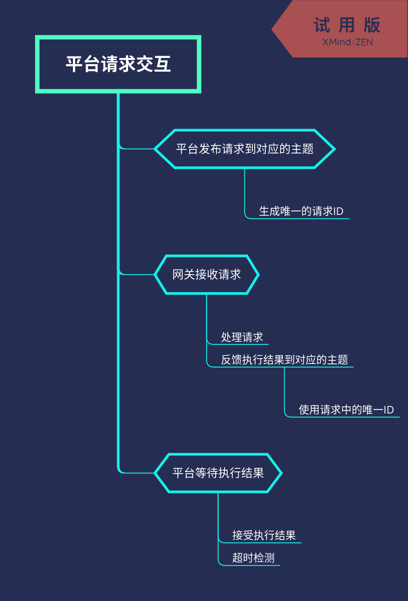

# 网关配置

## Topic列表

| TOPIC | 说明 | QOS | 方向 |
| :--- | :--- | :--- | :--- |
| /<gateway_sn>/sys/enable/data | 开启数据上送（禁止数据上送时，只上送网关本身状态数据) | 0/1 | 网关订阅 |
| /<gateway_sn>/sys/enable/event | 更改设备事件上送等级 | 0/1 | 网关订阅 |
| /<gateway_sn>/sys/cloud_conf | 云中心连接配置 | 0/1 | 网关订阅 |
| /<gateway_sn>/sys/upgrade | 网关固件升级 | 0/1 | 网关订阅 |
| /<gateway_sn>/sys/upgrade_ack | 网关固件升级确认 | 0/1 | 网关订阅 |
| /<gateway_sn>/sys/restart | 网关软件重启 | 0/1 | 网关订阅 |
| /<gateway_sn>/sys/reboot | 网关设备重启 | 0/1 | 网关订阅 |
| /<gateway_sn>/result/sys | 执行结果反馈 | 0/1 | 网关上送 |

## 开启数据上送

示例：

``` json
{
    "id":"<id_from_platform_uniqueue>",
    "data": 0
}
```

| 数据项 | 说明 | 备注 |
| :--- | :--- | :---- |
| id | 请求唯一ID，用作反馈执行结果 | 建议使用UUID字符串 |
| data | 是否开启数据上送（整数) | 1为上送，其他为不上送 |

## 更改设备事件上送等级

示例：

``` json
{
    "id":"<id_from_platform_uniqueue>",
    "data": 1
}
```

| 数据项 | 说明 | 备注 |
| :--- | :--- | :---- |
| id | 请求唯一ID，用作反馈执行结果 | 建议使用UUID字符串 |
| data | 最小上送等级(整数) | 0:调试，1:信息, 2:警告, 3:错误, 99:严重错误 |

## 云中心连接配置

示例：

``` json
{
    "id":"<id_from_platform_uniqueue>",
    "data": {
        "cov": true,
        "cov_ttl": 300,
        "keepalive": 300,
        "secret": "XXd90sssda",
    }
}
```

| 数据项 | 说明 | 备注 |
| :--- | :--- | :---- |
| id | 请求唯一ID，用作反馈执行结果 | 建议使用UUID字符串 |
| data | 要更改的参数 | |
| data.host | 服务器地址 | |
| data.port | 服务器端口 | |
| data.keepalive | 保活时长 | number |
| data.secret | 认证加密密钥 | string |
| data.cov | 是否开启数据变化传输 | boolean |
| data.cov_ttl | 数据变化传输强制上传周期(总召) | number |
| data.data_upload_period | 周期上送周期（数据打包） | |
| data.data_upload_period_limit | 数据打包点数最大数量 | |
| data.data_cache | 是否开启数据断线缓存 | boolean |

## 网关固件升级

示例：

``` json
{
    "id":"<id_from_platform_uniqueue>",
    "data": {
        "no_ack": true,
        "version": 1891,
        "skynet": {
            "version": 300,
            "platform": "openwrt/x86_64"
        }
    }
}
```

| 数据项 | 说明 | 备注 |
| :--- | :--- | :---- |
| id | 请求唯一ID，用作反馈执行结果 | 建议使用UUID字符串 |
| data | 升级参数 | |
| data.no_ack | 是否需要手工确认,用户需要在一定时间内发送确认消息，否则网关版本则回退至原有版本 | |
| data.version | 需要升级到的版本号 | 整数 |
| data.skynet | FreeIOE特有升级信息 | object |
| data.skynet.version | Skynet版本信息 | object |
| data.skynet.platform | 硬件平台信息（用以强制设备升级到指定硬件平台版本) 不指定时，FreeIOE将自动检测硬件平台 | |

## 网关固件升级确认

示例：

``` json
{
    "id":"<id_from_platform_uniqueue>",
    "data": {}
}
```

| 数据项 | 说明 | 备注 |
| :--- | :--- | :---- |
| id | 请求唯一ID，用作反馈执行结果 | 建议使用UUID字符串 |
| data | 数据节点 | 空节点 |

## 网关软件重启

示例：

``` json
{
    "id":"<id_from_platform_uniqueue>",
    "data": {}
}
```

| 数据项 | 说明 | 备注 |
| :--- | :--- | :---- |
| id | 请求唯一ID，用作反馈执行结果 | 建议使用UUID字符串 |
| data | 数据节点 | 空节点 |

## 网关设备重启

示例：

``` json
{
    "id":"<id_from_platform_uniqueue>",
    "data": {}
}
```

| 数据项 | 说明 | 备注 |
| :--- | :--- | :---- |
| id | 请求唯一ID，用作反馈执行结果 | 建议使用UUID字符串 |
| data | 数据节点 | 空节点 |

### 请求执行结果反馈

示例:

``` json
{
    "id":"XXXXXX",
    "result":true,
    "message":"Done",
    "timestamp":1562474541.01,
    "timestamp_str":"Sun Jul  7 13:04:13 2019"
}
```

| 数据项 | 说明 | 备注 |
| :--- | :--- | :---- |
| id | 指令执行请求的唯一ID | 来自指令执行请求时平台下发的id属性 |
| result | 结果(boolean) | |
| message | 执行结果信息（字符串) | |
| timestamp | 执行反馈时间戳 | |
| timestamp_str | 执行反馈时间戳字符串（不包含毫秒值) | |

## 平台请求、网关结果反馈流程


