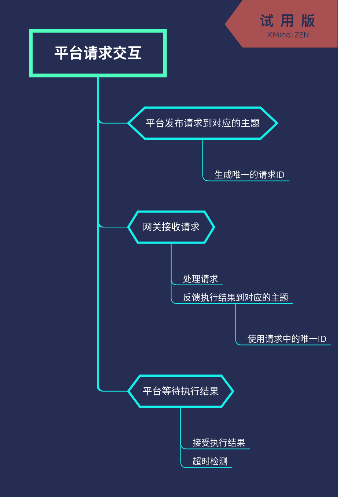

# 网关配置

## Topic列表

| TOPIC | 说明 | QOS | 方向 |
| :--- | :--- | :--- | :--- |
| /<gateway_sn>/log | 日志上送 | 0/1 | 网关上送 |
| /<gateway_sn>/comm | 报文上送 | 0/1 | 网关上送 |
| /<gateway_sn>/sys/enable/log | 开启网关日志上送 | 0/1 | 网关订阅 |
| /<gateway_sn>/sys/enable/comm | 开启网关报文上送 | 0/1 | 网关订阅 |
| /<gateway_sn>/result/sys | 执行结果反馈 | 0/1 | 网关上送 |

## 日志上送

示例:
``` json
["DEBUG",1562474541.01,"[0000001a]: ::test:: publish_data_list begib"]
```

| 数据项 | 说明 | 备注 |
| :--- | :--- | :---- |
| 0 | 等级: TRACE/DEBUG/INFO/NOTICE/WARNING/ERROR | |
| 1 | 时间戳 | |
| 2 | 日志信息。其中0000001a是应用进程ID, test是应用实例名 | |

## 报文上送

示例:
``` json
["2-30002-001843-00059.dlt645/IN",1562474541.01,"eHh4eHh4eHh4eHh4eHh4eHh4eHh4eHh4eHh4eHh4eHh4eHgK"]
```

| 数据项 | 说明 | 备注 |
| :--- | :--- | :---- |
| 0 | 主题: \<device_sn\|app_inst\>/\<dir\> | 设备序列号/应用示例名 + 报文说明（方向） |
| 1 | 时间戳 | |
| 2 | 报文内容（二进制数据base64后的字符串) | |

## 开启日志/报文上送

示例：

``` json
{
    "id":"<id_from_platform_uniqueue>",
    "data": 60
}
```

| 数据项 | 说明 | 备注 |
| :--- | :--- | :---- |
| id | 请求唯一ID，用作反馈执行结果 | 建议使用UUID字符串 |
| data | 日志/报文上送时长 | 单位：秒 |

### 请求执行结果反馈

示例:

``` json
{
    "id":"XXXXXX",
    "result":true,
    "message":"Done",
    "timestamp":1562474541.01,
    "timestamp_str":"Sun Jul  7 13:04:13 2019"
}
```

| 数据项 | 说明 | 备注 |
| :--- | :--- | :---- |
| id | 指令执行请求的唯一ID | 来自指令执行请求时平台下发的id属性 |
| result | 结果(boolean) | |
| message | 执行结果信息（字符串) | |
| timestamp | 执行反馈时间戳 | |
| timestamp_str | 执行反馈时间戳字符串（不包含毫秒值) | |

## 平台请求、网关结果反馈流程


