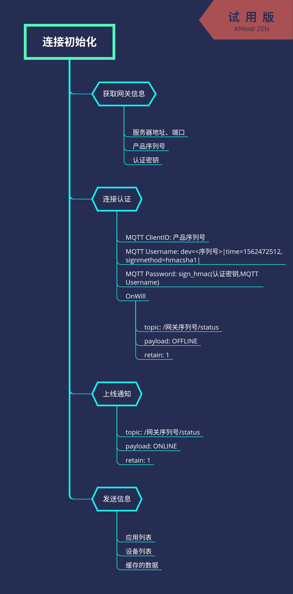

# MQTT-TCP连接说明

## MQTT客户端直连

1. 推荐使用TLS加密。如使用TLS加密，需要[下载根证书](https://ioe.thingsroot.com/files/root.crt)
2. 使用MQTT客户端连接服务器。连接方法，请参见[开源MQTT客户端参考](https://github.com/mqtt/mqtt.github.io/wiki/libraries?spm=a2c4g.11186623.2.11.2d4d78dcSnN67J)。如果需了解MQTT协议，请[参考 MQTT.ORG](http://mqtt.org) 相关文档
3. 使用FreeIOE网关

| 参数 | 说明 |
| :--- | :--- |
| Host | ioe.thingsroot.com |
| Port | 1883/8883 |
| Keep Alive | 建议取值范围为: 60 - 1200 |
| ClientID | 网关产品序列号，如 TRTX011902000001 |
| Username | dev=\<ClientID>\|time=1562472512,signmethod=hmacsha1\| |
| Password | sign_hmac(DeviceSecret, Username) |

备注：

* signmethod：表示签名算法类型。支持hmacmd5，hmacsha1和hmacsha256，默认为hmacsha1。

## 使用HTTPS认证再连接（研发中)

1. 认证设备。
   * 使用HTTPS进行设备认证\
        * 认证请求地址: https://ioe.thignsroto.com/mqtt_auth/<网关产品序列号>。
        * 请求响应(JSON格式):

    ``` json
    {
        "ok" : true,
        "data" : "42Ze0mkxxxxxxxx1AlTP",
    }
    ```

   * 使用HTTP响应中的data(DeviceSecret)来作为MQTT Password中的DeviceSecret进行MQTT连接

2. 连接MQTT
   1. 下载平台证书[root.crt](https://ioe.thingsroot.com/files/root.crt)
   2. 设备连接MQTT服务器地址

## MQTT保活

设备端在保活时间间隔内，至少需要发送一次报文，包括ping请求。

如果物联网平台在保活时间内无法收到任何报文，物联网平台会断开连接，设备端需要进行重连。

连接保活时间的取值范围为60至1200秒。建议取值300秒以上。

## 交互流程


