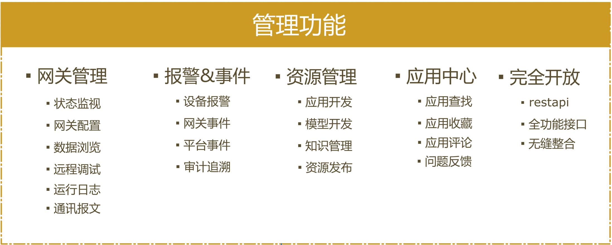
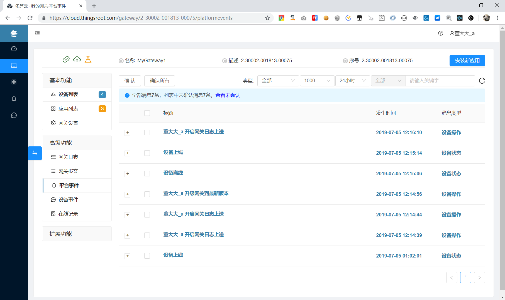

## ThingsCloud是什么？

------

ThingsCloud是一个边缘计算应用在线开发（包含版本管理及应用分发等功能）和边缘计算节点管理运维的一体化中台系统。

在ThingsCloud平台，您可以寻找您需要的边缘计算应用并收藏它，你也可以注册成为开发者，为其他用户提供包含您的智慧和经验的应用程序，您还可以在ThingsCloud上创建你的团队一起来开发边缘计算应用；

通过ThingsCloud平台，您可以管理您名下所有的边缘计算网关（当然，网关中需要运行我们的边缘计算开发框架[FreeIOE](https://github.com/freeioe/freeioe) ），在平台上，您可以查看你的任何一台网关的实时状态以及所有信息；在平台上，您可对你的任何一台网关安装你需要的边缘计算应用（无论是平台提供的还是第三方开发者提供的，或者是你自己开发的）；在平台上，您可对你的任何一台网关中运行的程序进行管理。

通过ThingsCloud平台，您可以思考通过边缘计算网关将适合的功能转移到边缘计算网关处理而有效的降低平台的负载或者业务的复杂度；你可以考虑将边缘网关和平台有效的联动起来，实现平台定义规则下发边缘网关，边缘网关根据最新的规则执行平台下发的任务。

通过ThingsCloud平台，你可将边缘计算网关采集的数据及信息都存储起来，通过ThingsCloud平台提供的功能接口（REST API）开发你的上层业务应用。

通过ThingsCloud平台，您可以追溯到你名下所有网关的操作记录以及设备事件。

## 特性

统一的管理入口

完整的日志事件

全功能的REST接口

可选数据存储

高效且灵活的开发模式

## ThingsCloud能做什么

如果您希望给您的用户提供一体化，一致性的平台使用体验，ThingsCloud将是你最好的选择。

如果您希望追溯到名下任何一台网关的操作记录，那ThingsCloud会完全满足你的需要。

如果您想快速接入一个设备，想在边缘侧完成数据的处理和计算，想远程对设备编程，想实现云和端的协同处理，ThingsCloud一定不负所托。

如你是一个开发者，你可以在ThingsCloud成为一个应用开发者，将你的经验和智慧转化为用户需要的边缘计算应用，卖给需要的用户。