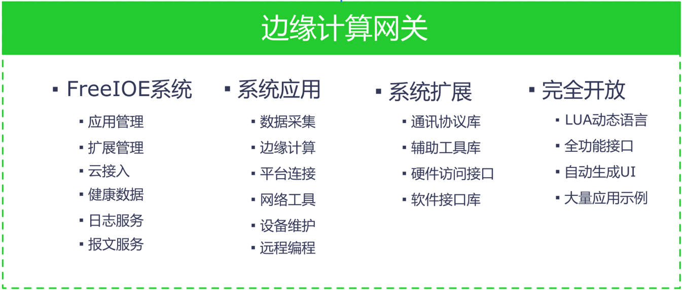

## FreeIOE是什么？

---

[FreeIOE](https://github.com/freeioe/freeioe)  是一个为快速开发工业物联网（IIOT）边缘计算应用而产生的开发框架，[FreeIOE](https://github.com/freeioe/freeioe)  是在[skynet](https://github.com/cloudwu/skynet) 开源项目上结合IIOT边缘计算的部分应用场景及业务特点产生的，本意是为了解决搭建工业物联网（IIOT）系统时快速开发工业现场设备数据采集应用，快速对数据预处理，快速连接各种物联网平台等需求。而当[FreeIOE](https://github.com/freeioe/freeioe) 研发完成后，我们发现使用[FreeIOE](https://github.com/freeioe/freeioe) 不仅可以快速开发各种IIOT应用，同时也提供了应用管理，扩展管理，应用日志，通讯报文，云连接等功能；另外，为了使用者能通过互联网更方便的管理和运维分布在全球的FreeIOE运行节点，我们开发了FreeIOE的运维平台[ThingsCloud](http://cloud.thingsroot.com)，通过ThingsCloud，使用者可以非常方便的在管理及运维自己名下的所有FreeIOE节点。因此，使用[FreeIOE](https://github.com/freeioe/freeioe) + [ThingsCloud](http://cloud.thingsroot.com) 来开发，分发，管理，追溯，批量部署IIOT边缘计算应用就变得非常简单和方便。

FreeIOE 项目地址：https://github.com/freeioe/freeioe

FreeIOE 开发指南：https://github.com/freeioe/freeioe_app_api_book

FreeIOE 应用示例：https://github.com/freeioe/freeioe_example_apps

## FreeIOE和传统的工业数据采集软件的区别

FreeIOE的设计目标及产品定位以致于和传统的工业数据采集软件有着很大的区别，这么说并不就是说FreeIOE比传统的工业数据采集软件多好多强，我们从各自的设计目标来看：

传统的工业数据采集软件主要功能是解决将现场的各种设备和系统的数据由多厂家、多协议、行业标准协议、厂家私有协议等转为某一种行业的标准协议，本身考虑的应用场景是工厂内部，因此对于物联网平台这种采集节点分散，希望统一的管理运维以及配置平台化的需求是没有考虑的。

FreeIOE的定位是物联网平台中边缘计算的节点，因此从设计之初就采用了分层设计，组件化，模块化，全开发的设计思想。而且将FreeIOE的远程配置，管理运维作为一个基础的功能提供。之所以这么设计，我们深刻认识到物联网平台的本质并不只是工业数据的汇聚和客户业务+互联网的叠加，而是使用各种新技术构建全新生产力工具对用户业务的升级。我们认为FreeIOE不再只是物联网平台的数据采集转发节点，而是在构建一个庞大的分布式边缘计算网络，因此，FreeIOE是一个完全开发的边缘计算应用开发框架，不仅可以完成我们常规认为的数据采集，数据预加工，数据上云等基本功能，还能实现很多用户定制化的需求和应用，为用户提供无限可能的想象空间。

每一个产品都有自己的定位，FreeIOE深度的贴合了工业物联网的当前需求及未来的发展需要，同时也很好的借鉴了大量传统的工控软件的功能及优点。

## 特性

- **应用组件化：** 优秀的组件化设计，自取所需。每个应用解决一个具体场景的问题，简洁易用、随用随走。
- **快速开发应用：**高效简洁的Lua语言让应用开发更加得心应手。
- **友好的调试信息：**应用的运行日志，设备的通讯报文，帮助开发者快速定位问题。
- **配套的云服务：**提供完全免费的云端管理服务，通过云端服务，如同本地使用。
- **云端信息存储：** 应用/配置/数据都在云端，永不丢失。
- 

## FreeIOE能做什么?

简单的，你可以使用FreeIOE在采集一个或多个工业智能设备的数据，将采集到的所有数据（包含FreeIOE自身的变量）通过MQTT协议推送到私有云或公有云平台（阿里云，百度云，华为云，亚马逊云等）；也可使用FreeIOE在采集一个或多个工业智能设备的数据，将采集到的所有数据转为工业标准协议OPCUA；还可以使用FreeIOE在采集一个或多个工业智能设备的数据，将采集到的所有数据写到网络中的MySQL数据库。

数据的采集和转发仅仅是FreeIOE最基础的功能，由于FreeIOE是一个全开放的边缘计算应用开发框架，因此，用户可通过开源的社区，第三方开发者，应用厂商，或者自主开发去获得满足自己需求的应用，下面列举一些应用场景仅仅是抛砖引玉：

1. 远程编程：远程编程应用+用户自建的中转服务器获得安全可靠高速的远程编程体验
2. 设备配置：开发目标设备专有应用，实现数据采集无需人工参与的设备云，实现设备应用功能的自动分发，自动部署及升级。
3. 设备预警：采集设备数据本地存储/计算/分析，同时和云端协同，更改云端策略调整计算规则及其他。
4. ……

