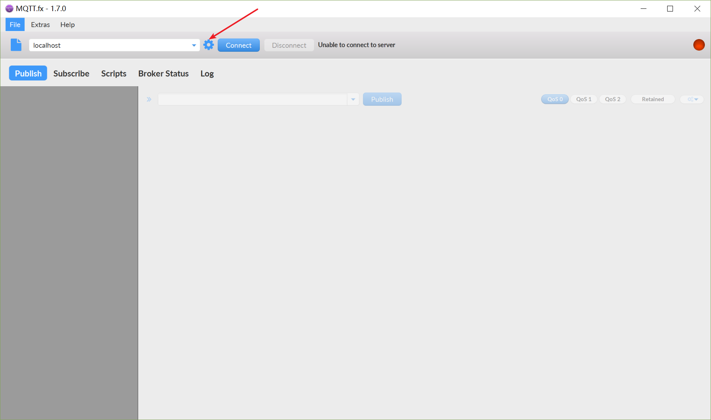
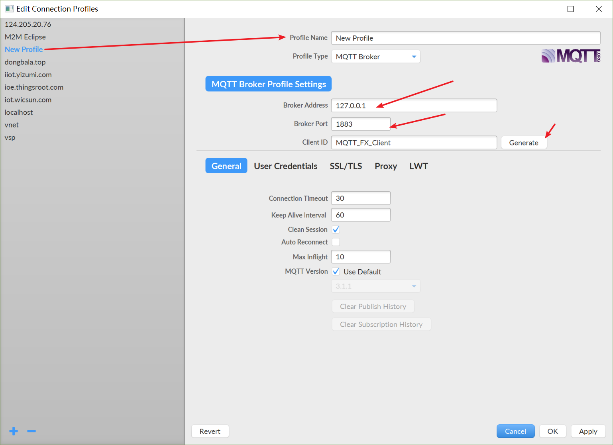
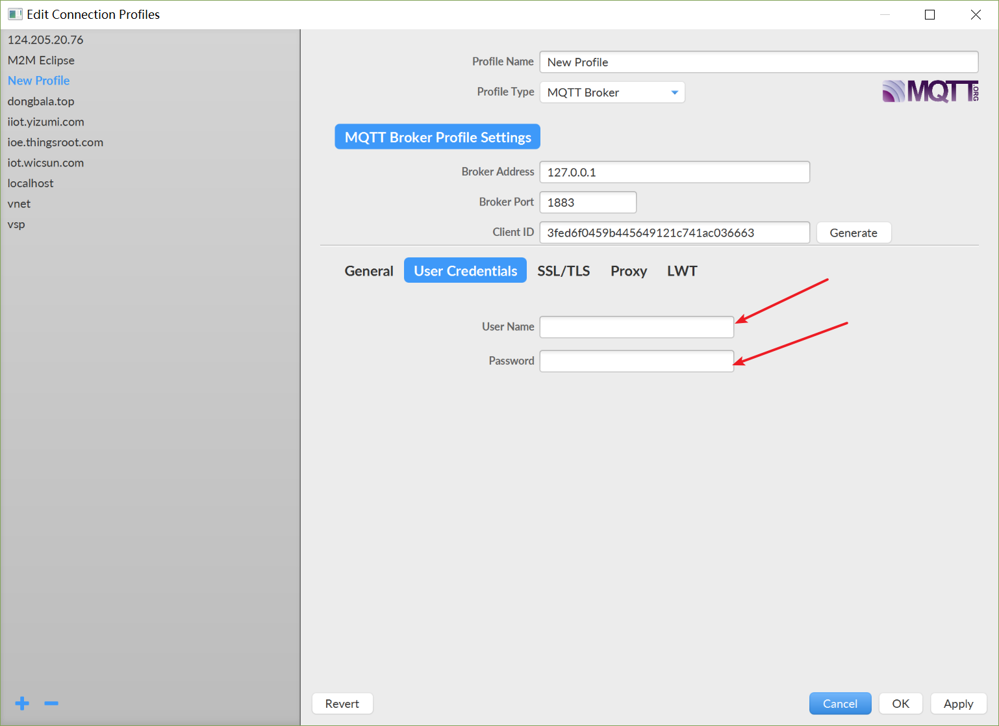
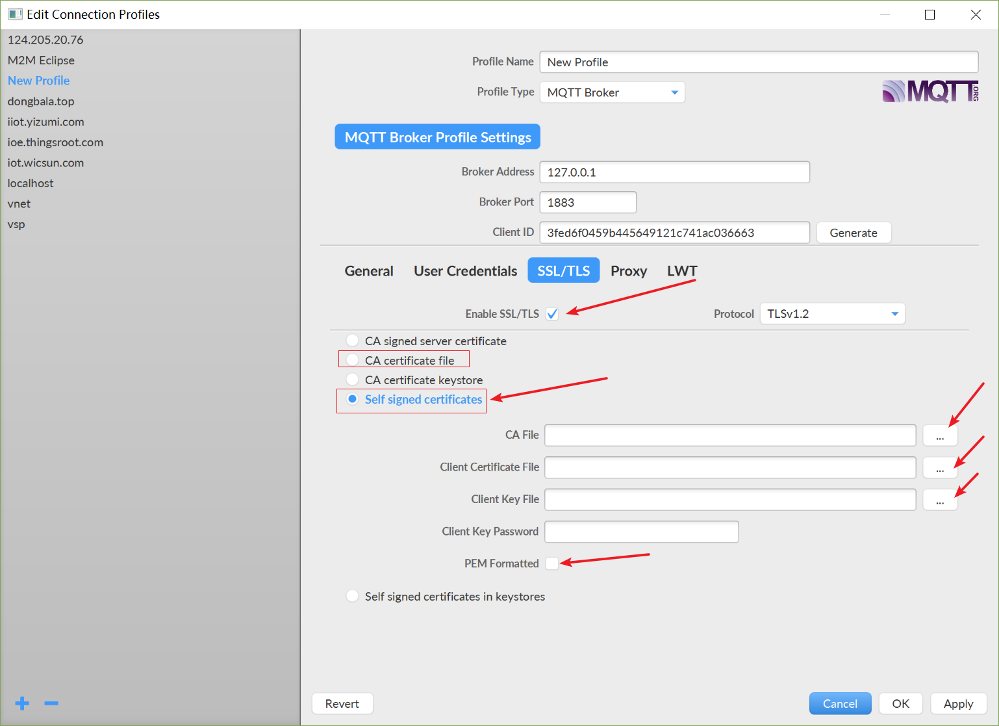
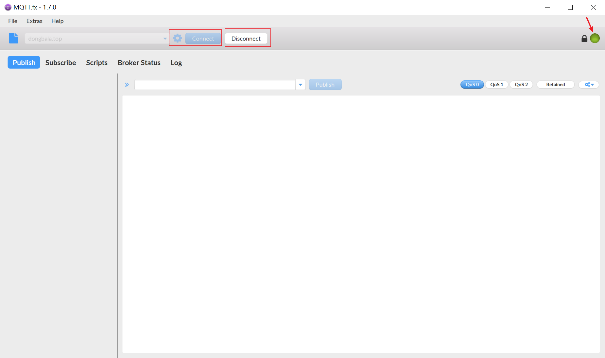
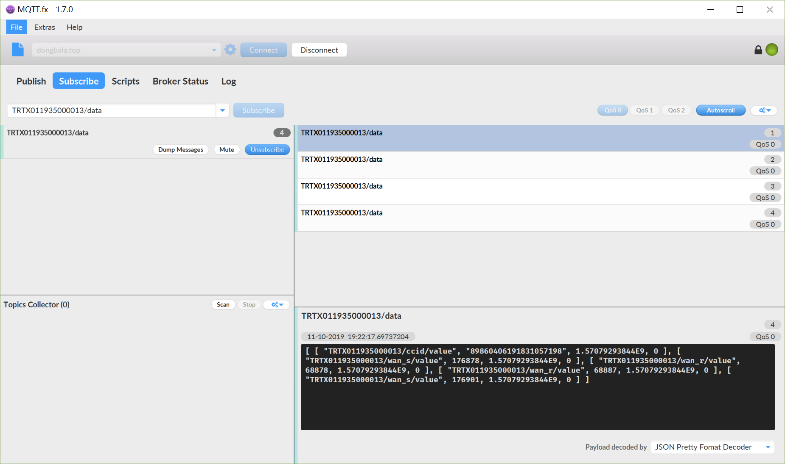
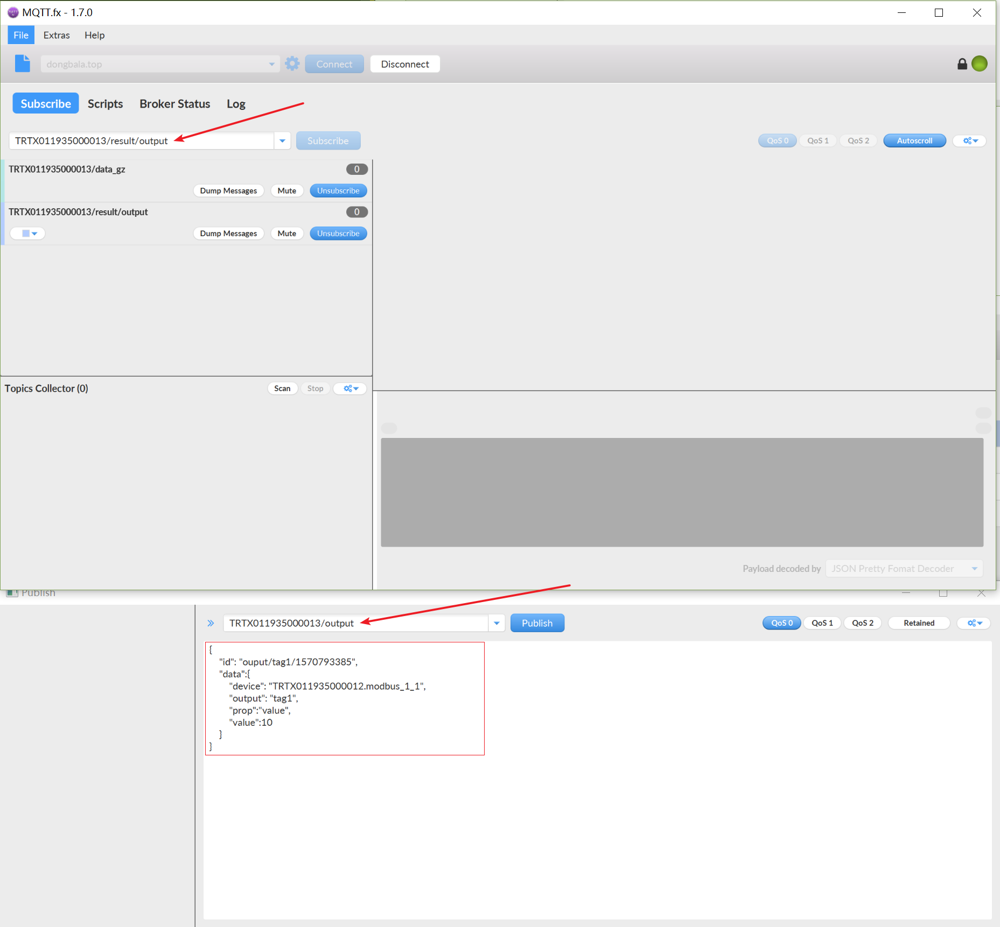

## 使用MQTT客户端验证数据

### 安装MQTT客户端
这里使用网上使用者较多的mqtt客户端工具mqttfx [点击下载](http://mqttfx.jensd.de/index.php/download)。

### 连接MQTT服务器

### MQTT数据相关主题说明
[MQTT数据相关主题](https://github.com/thingsroot/mqtt_standard/blob/master/%E8%AE%BE%E5%A4%87.md)

### 订阅消息(查看设备数据))
订阅实时变化数据

订阅实时变化数据(压缩)

### 发布消息(下置设备数据)
向现场设备某个点下置数据前，需要确认目标设备的点是否允许写入。
向现场设备下置数据
